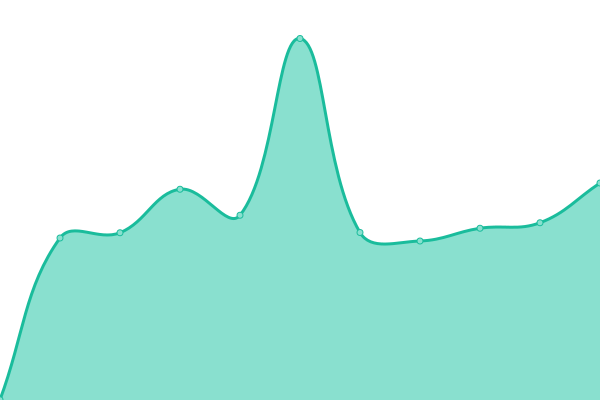

# [📈 Live Status](https://beam7894123.github.io/web_status): <!--live status--> **🟧 Partial outage**

This repository contains the open-source uptime monitor and status page for [BezaTheCat](bezathecat.com), powered by [Upptime](https://github.com/upptime/upptime).

With [Upptime](https://upptime.js.org), you can get your own unlimited and free uptime monitor and status page, powered entirely by a GitHub repository. We use [Issues](https://github.com/beam7894123/web_status/issues) as incident reports, [Actions](https://github.com/beam7894123/web_status/actions) as uptime monitors, and [Pages](https://beam7894123.github.io/web_status) for the status page.

<!--start: status pages-->
<!-- This summary is generated by Upptime (https://github.com/upptime/upptime) -->
<!-- Do not edit this manually, your changes will be overwritten -->
<!-- prettier-ignore -->
| URL | Status | History | Response Time | Uptime |
| --- | ------ | ------- | ------------- | ------ |
|  [Main](https://bezathecat.com/) | 🟩 Up | [main.yml](https://github.com/beam7894123/status/commits/HEAD/history/main.yml) | 

 945ms
     
 | 

<a href="https://beam7894123.github.io/status/history/main">100.00%</a>
    

|  [Thai Translate site](https://thaitranslateby.bezathecat.com/) | 🟩 Up | [thai-translate-site.yml](https://github.com/beam7894123/status/commits/HEAD/history/thai-translate-site.yml) | 

 949ms
     
 | 

<a href="https://beam7894123.github.io/status/history/thai-translate-site">100.00%</a>
    

|  File Service (Nextcloud) | 🟥 Down | [file-service-nextcloud.yml](https://github.com/beam7894123/status/commits/HEAD/history/file-service-nextcloud.yml) | 

 3413ms
     
 | 

<a href="https://beam7894123.github.io/status/history/file-service-nextcloud">84.91%</a>
    

|  Archive Service (Hydrus network api) | 🟥 Down | [archive-service-hydrus-network-api.yml](https://github.com/beam7894123/status/commits/HEAD/history/archive-service-hydrus-network-api.yml) | 

 1387ms
     
 | 

<a href="https://beam7894123.github.io/status/history/archive-service-hydrus-network-api">92.11%</a>
    

|  Archive Booru (HyBooru) | 🟥 Down | [archive-booru-hy-booru.yml](https://github.com/beam7894123/status/commits/HEAD/history/archive-booru-hy-booru.yml) | 

 915ms
     
 | 

<a href="https://beam7894123.github.io/status/history/archive-booru-hy-booru">92.12%</a>
    

|  Photo Prism | 🟥 Down | [photo-prism.yml](https://github.com/beam7894123/status/commits/HEAD/history/photo-prism.yml) | 

 1312ms
     
 | 

<a href="https://beam7894123.github.io/status/history/photo-prism">80.07%</a>
    

<!--end: status pages-->

[**Visit our status website →**](https://beam7894123.github.io/web_status)

## 📄 License

- Powered by: [Upptime](https://github.com/upptime/upptime)
- Code: [MIT](./LICENSE) © [BezaTheCat](bezathecat.com)
- Data in the `./history` directory: [Open Database License](https://opendatacommons.org/licenses/odbl/1-0/)
